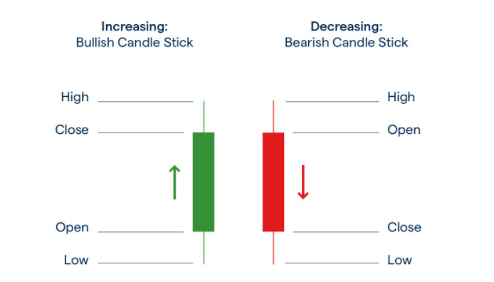

# Visualise-Crypto-Data
Small project used to visualise crypto I have invested in.
The project will be able to visualise the prices using candle sticks.
The crypto coin analysed will be up to the user via a GUI window, currently the user can choose from Cardano (ADA), Bitcoin (BTC) and Ethereum (ETH).

# Whats a candle stick?

# Tools/software Used
1. Python
2. Coinbase API

# How to run program
1. Git clone the project
2. cd into the folder where you cloned the project
3. pip.install -r requirements.txt
4. python main.py
5. Enter an avaliable crpto coin ticker value